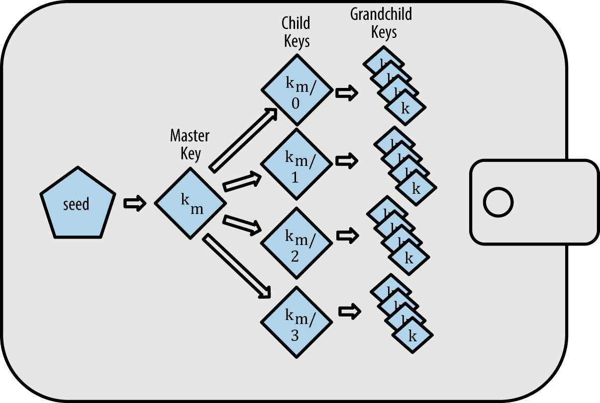

> 给大家讲讲比特币钱包。

# 钱包技术概述

一个常见误解是，比特币钱包里含有比特币。 事实上，钱包里只含有钥匙。 “钱币”被记录在比特币网络的区块链中。 用户通过钱包中的密钥签名交易，从而来控制网络上的钱币。 在某种意义上，比特币钱包是密钥链。

提示比特币钱包只含有密钥，而不是钱币。 每个用户有一个包含多个密钥的钱包。 钱包只包含私钥/公钥对的密钥链（请参阅[私钥章节]）。 用户用密钥签名交易，从而证明他们拥有交易输出（他们的钱币）。 钱币以交易输出的形式存储在区块链中（通常记为vout或txout）。

有两种主要类型的钱包，区别在于它们包含的多个密钥是否相互关联。

第一种类型是非确定性钱包（nondeterministic wallet），其中每个密钥都是从随机数独立生成的。密钥彼此无关。这种钱包也被称为“Just a Bunch Of Keys（一堆密钥）”，简称JBOK钱包。

第二种类型是确定性钱包（deterministic wallet），其中所有的密钥都是从一个主密钥派生出来，这个主密钥即为种子（seed）。该类型钱包中所有密钥都相互关联，如果有原始种子，则可以再次生成全部密钥。确定性钱包中使用了许多不同的密钥推导方法。最常用的推导方法是使用树状结构，称为分级确定性钱包或HD钱包。

确定性钱包由种子衍生创造。为了便于使用，种子被编码为英文单词，也称为助记词。

# 非确定性（随机）钱包

在最早的一批比特币客户端中（ Bitcoin Core，现在称作比特币核心客户端），钱包只是随机生成的私钥集合。这种类型的钱包被称作零型非确定钱包。举个例子，比 特币核心客户端预先生成100个随机私钥，从最开始就生成足够多的私钥并且每个密钥只使用一次。这种钱包现在正在被确定性钱包替换，因为它们难以管理、 备份以及导入。随机密钥的缺点就是如果你生成很多私钥，你必须保存它们所有的副本。这就意味着这个钱包必须被经常性 地备份。每一个密钥都必须备份，否则一旦钱包不可访问时，钱包所控制的资金就付之东流。这种情况直接与避免地址重复使用的原则相冲突——每个比特币地址只能用一次交易。地址重复使用将多个交易和地址关联在一起，这会减少隐私。当你想避免重复使用地址时，零型非确定性钱包并不是好的选择，因为你要创造过多的私钥并且要保存它们。虽然比特币核心客户端包含零型钱包，但比特币的核心开发者并不鼓励大家使用。

非确定性钱包，其含有的随机密钥是个松散的集合:

# 确定性（种子）钱包

确定性，或者“种子”钱包包含通过使用单项离散函数而可从公共的种子生成的私钥。种子是随机生成的数字。这个数字也含有比如索引号码或者可生成私钥的“链码”。在确定性钱包中，种子足够恢复所有的已经产生的私钥，所以只用在初始创建时的一个简单备份就足以搞定。并且种子也足够让钱包导入或者导出。这就很容易允许使用者的私钥在钱包之间轻松转移。

确定性钱包的逻辑图。

# 分层确定性钱包（HD Wallets (BIP-32/BIP-44)）

确定性钱包被开发成更容易从单个“种子”中生成许多密钥。确定性钱包的最高级形式是通过BIP0032标准定义的HD钱包。HD钱包包含以树状结构衍生的密钥，使得父密钥可以衍生一系列子密钥，每个子密钥又可以衍生出一系列孙密钥，以此类推，无限衍生。

树状结构:

相比较随机（不确定性）密钥，HD钱包有两个主要的优势。第一，树状结构可以被用来表达额外的组织含义。比如当一个特定分支的子密钥被用来接收交易收入并且有另一个分支的子密钥用来负责支付花费。不同分支的密钥都可以被用在企业环境中，这就可以支配不同的分支部门、子公司、具体功能以及会计类别。

HD钱包的第二个好处就是它可以允许让使用者去建立一个公共密钥的序列而不需要访问相对应的私钥。这可允许HD钱包在不安全的服务器中使用或者在每笔交易中发行不同的公共钥匙。公共钥匙不需要被预先加载或者提前衍生，而在服务器中不需要可用来支付的私钥。

# 助记码词汇

助记码词汇是英文单词序列代表（编码）用作种子对应所确定性钱包的随机数。单词的序列足以重新创建种子，并且从 种子那里重新创造钱包以及所有私钥。在首次创建钱包时，带有助记码的，运行确定性钱包的钱包的应用程序将会向使用者展示一个12至24个词的顺序。单词的顺序就是钱包的备份。它也可以被用来恢复以及重新创造应用程序相同或者兼容的钱包的密钥。助记码词汇可以让使用者复制钱包更容易一些，因为相比较随机数字顺序来说，它们更容易地被阅读和正确抄写。

# 创建助记词

助记词是由钱包使用BIP-39中定义的标准化过程自动生成的。 钱包从熵源开始，增加校验和，然后将熵映射到单词列表：

1、创建一个128到256位的随机序列（熵）。

2、提出SHA256哈希前几位（熵长/ 32），就可以创造一个随机序列的校验和。

3、将校验和添加到随机序列的末尾。

4、将序列划分为包含11位的不同部分。

5、将每个包含11位部分的值与一个已经预先定义2048个单词的字典做对应。

6、生成的有顺序的单词组就是助记码。

下图展示了熵如何生成助记词:

# 从种子中创造HD钱包
HD钱包从单个根种子（root seed）中创建，为128到256位的随机数。最常见的是，这个种子是从助记符产生的。

HD钱包的所有的确定性都衍生自这个根种子。任何兼容HD 钱包的根种子也可重新创造整个HD钱包。所以简单的转移HD钱包的根种子就让HD钱包中所包含的成千上百万的密钥被复制，储存导出以及导入。

创建主密钥以及HD钱包的主链代码的过程:

根种子输入到HMAC-SHA512算法中就可以得到一个可用来创造主私钥(m)（master private key(m) ）和主链代码（a master chain code）的哈希。主私钥（m）之后可以通过使用普通椭圆曲线m * G过程生来成相对应的主公钥（M）。 链代码用于从母密钥中创造子密钥的那个函数中引入熵。
